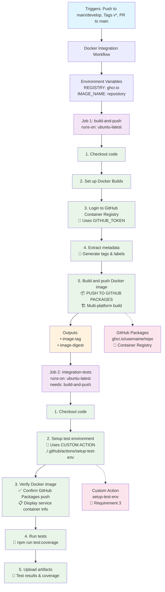

# Docker Integration Workflow Diagram

This diagram visualizes the `docker-integration.yml` workflow that fulfills **GitHub Actions Requirement 2** (GitHub Packages + Service Containers).

## Mermaid Flow Diagram



## ASCII Flow Diagram (Alternative)

```
┌─────────────────────────────────────────────────────────────────┐
│                    DOCKER INTEGRATION WORKFLOW                  │
└─────────────────────────┬───────────────────────────────────────┘
                          │
    ┌─────────────────────▼────────────────────────┐
    │  TRIGGERS: push (main/develop), tags, PRs    │
    └─────────────────────┬────────────────────────┘
                          │
    ┌─────────────────────▼────────────────────────┐
    │  ENV: REGISTRY=ghcr.io, IMAGE_NAME=repo     │
    └─────────────────────┬────────────────────────┘
                          │
                          ▼
    ┌─────────────────────────────────────────────────────────────┐
    │                   JOB 1: build-and-push                    │
    │                   (ubuntu-latest)                          │
    ├─────────────────────────────────────────────────────────────┤
    │  1. ✅ Checkout code                                        │
    │  2. 🔧 Set up Docker Buildx                                │
    │  3. 🔑 Login to GitHub Container Registry                  │
    │  4. 📝 Extract metadata (tags/labels)                      │
    │  5. 📦 BUILD & PUSH TO GITHUB PACKAGES                    │
    │     • Multi-platform (linux/amd64, linux/arm64)           │
    │     • Cache optimization                                    │
    └─────────────────────┬───────────────────────────────────────┘
                          │
    ┌─────────────────────▼────────────────────────┐
    │  OUTPUTS: image-tag, image-digest            │
    └─────────────────────┬────────────────────────┘
                          │
                          ▼
    ┌─────────────────────────────────────────────────────────────┐
    │                JOB 2: integration-tests                    │
    │                (ubuntu-latest)                             │
    │                needs: build-and-push                       │
    ├─────────────────────────────────────────────────────────────┤
    │  1. ✅ Checkout code                                        │
    │  2. 🎯 Setup test environment (CUSTOM ACTION)              │
    │     └── uses: ./.github/actions/setup-test-env            │
    │  3. ✅ Verify Docker image in GitHub Packages             │
    │  4. 🧪 Run tests (npm run test:coverage)                  │
    │  5. 📂 Upload artifacts (test results)                    │
    └─────────────────────────────────────────────────────────────┘
                          │
                          ▼
    ┌─────────────────────────────────────────────────────────────┐
    │                    INTEGRATIONS                             │
    ├─────────────────────────────────────────────────────────────┤
    │  📦 GitHub Packages (ghcr.io)                              │
    │     └── Stores Docker images with automatic tagging       │
    │                                                             │
    │  🎯 Custom Action (setup-test-env)                         │
    │     └── Demonstrates reusable workflow components          │
    │                                                             │
    │  📊 Artifacts                                               │
    │     └── Test results and coverage reports                  │
    └─────────────────────────────────────────────────────────────┘
```

## Key Workflow Features

### 🎯 Requirement Fulfillment

1. **GitHub Packages Integration** (Requirement 2):
   - Builds Docker image from `Dockerfile`
   - Pushes to GitHub Container Registry (`ghcr.io`)
   - Uses automatic authentication with `GITHUB_TOKEN`
   - Implements multi-platform builds (amd64, arm64)

2. **Service Container Demonstration**:
   - Shows how Docker images can be built and stored
   - Demonstrates pattern for using images as service containers
   - Provides verification and usage instructions

3. **Custom Action Usage** (Requirement 3):
   - Uses `./.github/actions/setup-test-env` custom action
   - Shows encapsulation of common setup steps
   - Demonstrates reusable workflow components

### 🔄 Workflow Dependencies

- **Job 1** → **Job 2**: `integration-tests` needs `build-and-push` to complete
- **Outputs**: Job 1 provides image tags and digest to Job 2
- **Parallel Execution**: Not applicable due to dependency chain

### 📊 Artifacts and Outputs

- **Docker Image**: Stored in GitHub Packages (`ghcr.io`)
- **Test Artifacts**: Test results and coverage reports
- **Metadata**: Image tags, labels, and digest information

### 🎪 Interactive Elements

- **Multi-trigger**: Responds to pushes, PRs, and tags
- **Conditional Steps**: Artifact upload runs even if tests fail
- **Dynamic Tagging**: Automatic image tagging based on trigger type
