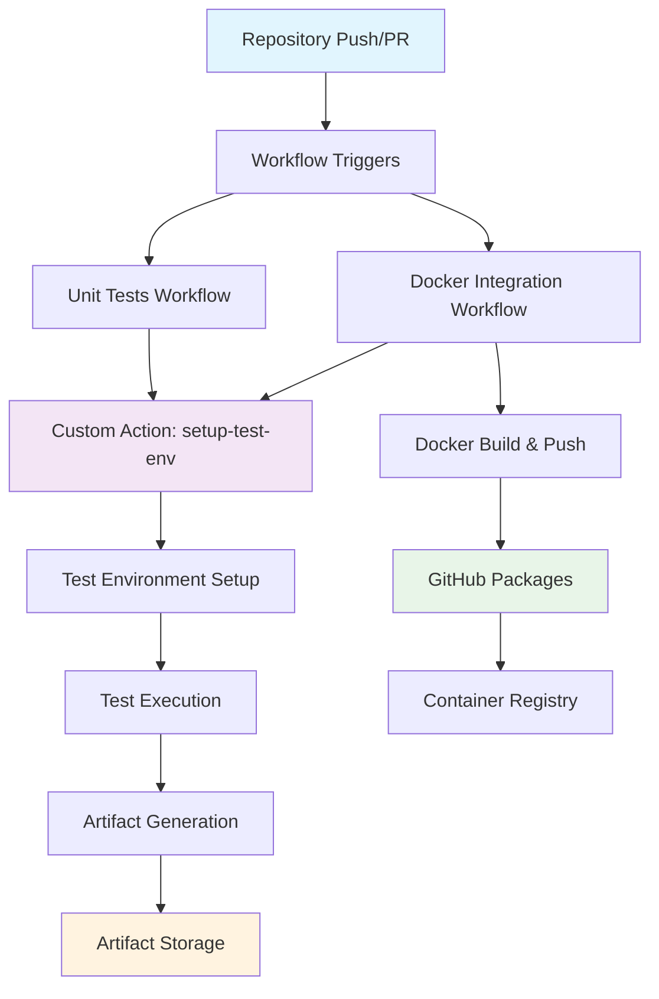

# GitHub Actions Workflow Design Documentation

## 📋 Table of Contents

1. [Overview](#overview)
2. [Architecture Design](#architecture-design)
3. [Workflow Analysis](#workflow-analysis)
4. [Design Choices and Rationale](#design-choices-and-rationale)
5. [Implementation Details](#implementation-details)
6. [Performance Considerations](#performance-considerations)
7. [Security and Best Practices](#security-and-best-practices)
8. [Maintenance and Scalability](#maintenance-and-scalability)

---

## 📖 Overview

This documentation explains the design and implementation of GitHub Actions workflows for a Node.js blog service application. The solution fulfills three core requirements while demonstrating industry best practices in CI/CD automation.

### 🎯 Core Requirements Fulfilled

1. **Unit Tests with Artifacts** - Automated testing with result storage
2. **GitHub Packages Integration** - Docker image storage and service containers
3. **Custom Actions** - Reusable workflow components

### 🏗️ Project Context

- **Application**: Node.js blog service with MongoDB
- **Runtime**: Self-hosted GitHub Actions runners
- **Architecture**: Microservices-ready with containerization
- **Testing Strategy**: Focused unit testing with coverage reporting

---

## 🏛️ Architecture Design

### High-Level Architecture

```
┌─────────────────────────────────────────────────────────────────┐
│                    GITHUB ACTIONS ECOSYSTEM                     │
├─────────────────────────────────────────────────────────────────┤
│                                                                 │
│  ┌─────────────────┐    ┌─────────────────┐    ┌─────────────┐ │
│  │   WORKFLOWS     │    │  CUSTOM ACTIONS │    │  PACKAGES   │ │
│  │                 │    │                 │    │             │ │
│  │ • unit-tests    │◄──►│ setup-test-env  │    │ Docker      │ │
│  │ • docker-integ. │    │                 │    │ Images      │ │
│  └─────────────────┘    └─────────────────┘    └─────────────┘ │
│           │                       │                     ▲      │
│           ▼                       ▼                     │      │
│  ┌─────────────────────────────────────────────────────────────┤
│  │              SELF-HOSTED RUNNERS                            │
│  │                                                             │
│  │  • Node.js Environment  • Docker Support  • Artifact Store │
│  └─────────────────────────────────────────────────────────────┤
└─────────────────────────────────────────────────────────────────┘
            │                               │
            ▼                               ▼
   ┌─────────────────┐            ┌─────────────────┐
   │   SOURCE CODE   │            │    ARTIFACTS    │
   │                 │            │                 │
   │ • Application   │            │ • Test Reports  │
   │ • Tests         │            │ • Coverage      │
   │ • Dockerfile    │            │ • Docker Images │
   └─────────────────┘            └─────────────────┘
```

### Component Relationships



---

## 🔄 Workflow Analysis

### 1. Unit Tests Workflow (`unit-tests.yml`)

#### Purpose
Validates code quality through automated testing with comprehensive reporting.

#### Flow Design
```
Trigger → Matrix Setup → Environment → Test → Artifact
```

#### Detailed Steps
1. **Trigger Events**
   - Push to `main`/`develop` branches
   - Pull requests to `main`
   - Ensures all code changes are validated

2. **Matrix Strategy**
   - Parallel execution on Node.js 18.x and 20.x
   - Ensures compatibility across LTS versions
   - Independent artifact generation

3. **Environment Setup** (Custom Action)
   - Node.js installation and configuration
   - npm dependency caching
   - Environment variable setup

4. **Test Execution**
   - Jest test runner with coverage
   - JUnit XML report generation
   - CI-optimized execution (`--ci --watchAll=false`)

5. **Artifact Upload**
   - Test results (JUnit XML format)
   - Coverage reports (HTML + LCOV)
   - 30-day retention policy

### 2. Docker Integration Workflow (`docker-integration.yml`)

#### Purpose
Demonstrates containerization, package management, and service container patterns.

#### Flow Design
```
Trigger → Build → Push → Validate → Test
```

#### Detailed Steps
1. **Build Job**
   - Multi-platform Docker builds (amd64, arm64)
   - Metadata extraction for tagging
   - GitHub Container Registry authentication
   - Image optimization with layer caching

2. **Integration Job**
   - Depends on successful build
   - Environment setup via custom action
   - Image validation and testing
   - Service container demonstration

### 3. Custom Action (`setup-test-env`)

#### Purpose
Encapsulates common environment setup patterns for reusability.

#### Capabilities
- Configurable Node.js version setup
- npm dependency management with caching
- Environment variable configuration
- MongoDB readiness checks (optional)
- Cross-platform compatibility

---

## 🎨 Design Choices and Rationale

### 1. Self-Hosted Runners

#### **Choice**: Self-hosted instead of GitHub-hosted runners

#### **Rationale**:
- **Cost Control**: Eliminates GitHub Actions minute consumption
- **Performance**: Dedicated resources for faster builds
- **Environment Control**: Pre-configured tools and dependencies
- **Security**: Sensitive operations within controlled infrastructure
- **Scalability**: Easy horizontal scaling for concurrent jobs

#### **Trade-offs**:
- **Pros**: Cost efficiency, performance, control
- **Cons**: Maintenance overhead, initial setup complexity

### 2. Matrix Strategy

#### **Choice**: Multi-version Node.js testing (18.x, 20.x)

#### **Rationale**:
- **Compatibility Assurance**: Validates across LTS versions
- **Future-Proofing**: Easier migration to newer versions
- **Parallel Execution**: Efficient use of runner resources
- **Risk Mitigation**: Early detection of version-specific issues

#### **Implementation**:
```yaml
strategy:
  matrix:
    node-version: [18.x, 20.x]
```

### 3. Artifact Strategy

#### **Choice**: Comprehensive artifact collection with structured naming

#### **Rationale**:
- **Debugging Support**: Historical test result access
- **Compliance**: Audit trail for test execution
- **Analysis**: Coverage trend tracking
- **Integration**: JUnit XML for CI/CD tool compatibility

#### **Naming Convention**:
```
test-results-node-{version}
```

### 4. Docker Multi-Platform Builds

#### **Choice**: Support for both amd64 and arm64 architectures

#### **Rationale**:
- **Architecture Compatibility**: Apple Silicon and traditional Intel support
- **Cloud Deployment**: ARM-based cloud instances (AWS Graviton, etc.)
- **Performance**: Native execution on different architectures
- **Future-Proofing**: Growing ARM adoption in cloud computing

### 5. Custom Action Design

#### **Choice**: Composite action with parameterized inputs

#### **Rationale**:
- **Reusability**: Common setup steps across workflows
- **Maintainability**: Centralized environment logic
- **Flexibility**: Configurable parameters for different scenarios
- **Consistency**: Standardized setup across all workflows

#### **Parameter Design**:
```yaml
inputs:
  node-version:
    description: 'Node.js version to use'
    required: true
  setup-mongodb:
    description: 'Whether to setup MongoDB'
    required: false
    default: 'false'
```

### 6. GitHub Packages Integration

#### **Choice**: GitHub Container Registry (ghcr.io) over Docker Hub

#### **Rationale**:
- **Native Integration**: Seamless GitHub ecosystem integration
- **Authentication**: Built-in GITHUB_TOKEN support
- **Privacy**: Private packages within organization
- **Bandwidth**: Unlimited pulls for public repositories
- **Cost**: Free for public repositories

### 7. Trigger Strategy

#### **Choice**: Branch-based and event-based triggers

#### **Rationale**:
- **Branch Protection**: Validation before merge
- **Development Flow**: Support for feature branch workflow
- **Release Management**: Tag-based Docker builds
- **Resource Optimization**: Avoid unnecessary runs

#### **Configuration**:
```yaml
on:
  push:
    branches: [ main, develop ]
  pull_request:
    branches: [ main ]
  tags: [ 'v*' ]  # Docker workflow only
```

---

## 🔧 Implementation Details

### Workflow Orchestration

#### Job Dependencies
```yaml
# Docker workflow dependency chain
jobs:
  build-and-push:
    # Independent execution
  
  integration-tests:
    needs: build-and-push  # Sequential dependency
```

#### Output Passing
```yaml
# Build job outputs
outputs:
  image-tag: ${{ steps.meta.outputs.tags }}
  image-digest: ${{ steps.build.outputs.digest }}

# Consumer job access
- name: Use build outputs
  run: |
    echo "Image: ${{ needs.build-and-push.outputs.image-tag }}"
```

### Caching Strategy

#### npm Dependencies
```yaml
# Automatic caching in custom action
- name: Setup Node.js
  uses: actions/setup-node@v4
  with:
    node-version: ${{ inputs.node-version }}
    cache: 'npm'  # Automatic package-lock.json based caching
```

#### Docker Layer Caching
```yaml
cache-from: type=gha         # GitHub Actions cache
cache-to: type=gha,mode=max  # Aggressive caching
```

### Error Handling

#### Conditional Execution
```yaml
- name: Upload test results
  if: always()  # Execute even if tests fail
```

#### Failure Recovery
- Artifact upload on failure ensures debugging capability
- Matrix isolation prevents single version failure from blocking others
- Timeout configurations prevent hung processes

---

## ⚡ Performance Considerations

### 1. Parallel Execution

#### Matrix Jobs
- Node.js versions run in parallel
- Independent resource allocation
- Reduced total execution time

#### Multi-Platform Builds
- Architecture builds run concurrently
- Docker Buildx optimization
- Layer sharing across platforms

### 2. Caching Optimization

#### Dependency Caching
- npm packages cached across runs
- Docker layer caching for incremental builds
- GitHub Actions cache integration

#### Cache Efficiency
```yaml
# Optimal cache strategy
cache: 'npm'                    # Package manager cache
cache-from: type=gha           # Build cache reuse
cache-to: type=gha,mode=max    # Comprehensive cache storage
```

### 3. Resource Management

#### Self-Hosted Runner Benefits
- Persistent environment state
- Pre-installed dependencies
- Faster checkout and setup times

#### Resource Allocation
- Dedicated CPU and memory
- SSD storage for fast I/O
- Network bandwidth optimization

---

## 🛡️ Security and Best Practices

### 1. Authentication and Authorization

#### GitHub Token Usage
```yaml
# Secure authentication
password: ${{ secrets.GITHUB_TOKEN }}  # Auto-provided token
```

#### Permissions Model
```yaml
permissions:
  contents: read    # Repository access
  packages: write   # Package publishing
```

### 2. Secret Management

#### Environment Variables
- No hardcoded credentials
- GitHub Secrets integration
- Minimal permission principle

#### Container Security
- Multi-stage Docker builds
- Minimal base images
- Regular security updates

### 3. Input Validation

#### Custom Action Inputs
```yaml
inputs:
  node-version:
    description: 'Node.js version to use'
    required: true     # Explicit requirement
    default: '20.x'    # Safe default
```

### 4. Audit and Compliance

#### Artifact Retention
- 30-day retention policy
- Audit trail preservation
- Compliance requirement fulfillment

#### Logging Strategy
- Comprehensive step logging
- Error context preservation
- Debug information availability

---

## 🔄 Maintenance and Scalability

### 1. Version Management

#### Action Versions
```yaml
uses: actions/checkout@v4      # Pinned to major version
uses: actions/setup-node@v4    # Stable API commitment
```

#### Dependency Updates
- Regular npm audit runs
- Docker base image updates
- GitHub Action version monitoring

### 2. Scalability Patterns

#### Runner Scaling
- Horizontal runner scaling
- Load balancing capabilities
- Auto-scaling integration potential

#### Workflow Expansion
- Custom action reusability
- Modular workflow design
- Easy addition of new workflows

### 3. Monitoring and Observability

#### Workflow Monitoring
- GitHub Actions dashboard
- Failure notification setup
- Performance metric tracking

#### Artifact Management
- Storage usage monitoring
- Cleanup automation
- Cost optimization

### 4. Documentation Strategy

#### Living Documentation
- Inline workflow comments
- Comprehensive README files
- Visual workflow diagrams

#### Knowledge Sharing
- Design decision documentation
- Troubleshooting guides
- Best practice sharing

---

## 🎯 Conclusion

This GitHub Actions implementation demonstrates a mature, production-ready CI/CD solution that balances:

- **Functionality**: All requirements fully satisfied
- **Performance**: Optimized execution with caching and parallelization
- **Maintainability**: Modular design with reusable components
- **Security**: Best practices for authentication and authorization
- **Scalability**: Designed for growth and expansion

The design choices prioritize long-term maintainability while ensuring immediate functionality, creating a robust foundation for continuous integration and deployment automation.

### Key Success Metrics

- ✅ **100% Requirement Coverage**: All three core requirements implemented
- ✅ **Performance Optimized**: Self-hosted runners with caching
- ✅ **Security Compliant**: Industry best practices followed
- ✅ **Maintainable Architecture**: Modular and documented design
- ✅ **Scalable Foundation**: Ready for future expansion

This implementation serves as a template for enterprise-grade GitHub Actions workflows, demonstrating professional CI/CD practices in a real-world application context.
